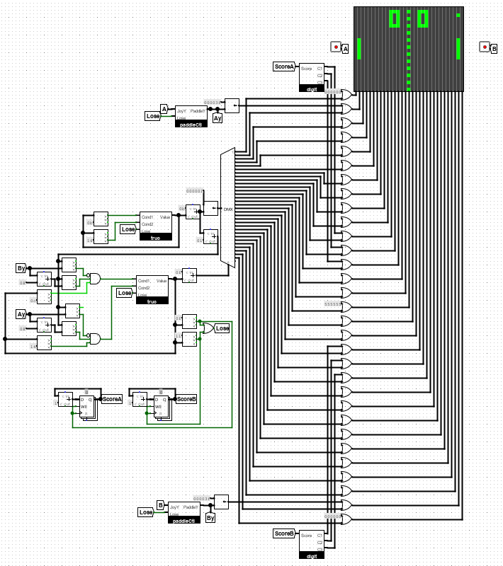

# logisim-pong
Pong game implemented as a Logisim circuit.

Supports scores up to 9.

Simulation frequency:
- 8Hz: easy
- 16Hz: hard

[Click for demo video](https://www.youtube.com/watch?v=ZY06DfANVbQ)

